# Microsoft 365 Identity & Enterprise Administration

## 📌 Project Overview

This project was completed as part of a Cloud Computing program and focuses on Microsoft 365 enterprise administration.

It simulates real-world responsibilities of an IT Administrator managing a Microsoft 365 environment, including identity management, PowerShell automation, Exchange configuration, and SharePoint deployment.

---

## 🧰 Technologies Used

* Microsoft 365 Admin Center
* Azure Active Directory (Azure AD)
* PowerShell (MSOnline / AzureAD modules)
* Exchange Online
* SharePoint Online

---

## 🏢 Scenario

A simulated organization environment was configured to demonstrate enterprise-level administration tasks such as user provisioning, service configuration, and collaboration setup.

---

# 🔐 Key Implementations

## 👥 Identity & User Management

* Created and managed users via Microsoft 365 Admin Center
* Configured user profiles and organizational settings
* Implemented group-based access control

---

## ⚙️ PowerShell Automation

* Connected to Microsoft 365 tenant using PowerShell
* Created users using command-line tools
* Assigned licenses programmatically

---

## 📧 Exchange Online

* Created shared mailboxes
* Configured distribution lists
* Tested internal email communication

---

## 📁 SharePoint Online

* Created SharePoint sites
* Configured document libraries
* Managed access permissions

---

## 🎨 Organization Customization

* Applied company branding (logo and theme)
* Configured organization profile settings
* Set targeted release preferences

---

# 📂 Repository Structure

(To be updated as files are added)

---

# 📸 Screenshots

## 👥 Identity & Organization

Configured organization branding and user experience settings.

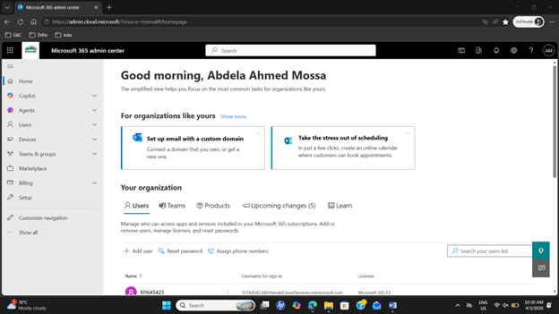
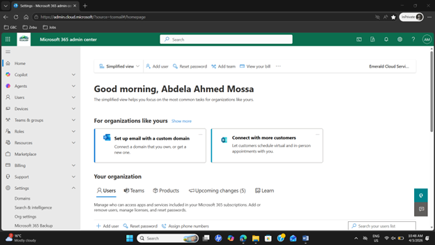
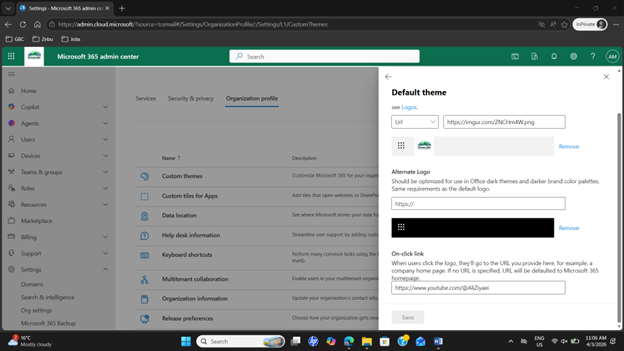
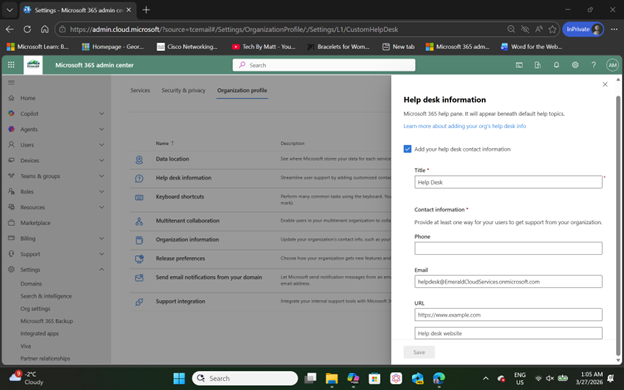

---

## ⚙️ PowerShell Automation

Automated user creation and license assignment using PowerShell.

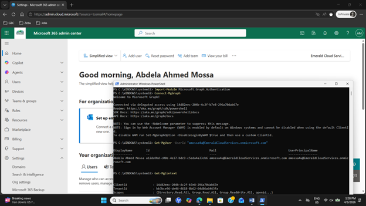
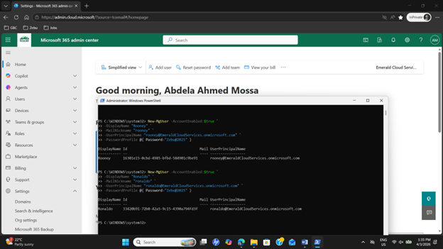
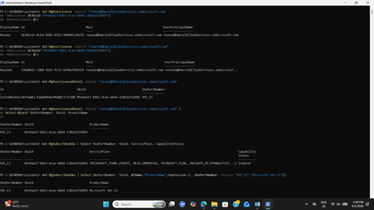

---

## 📧 Exchange Online

Configured mailboxes and tested communication flow.

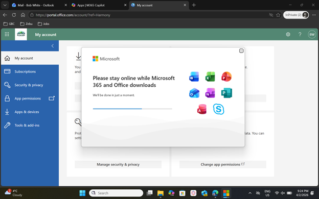
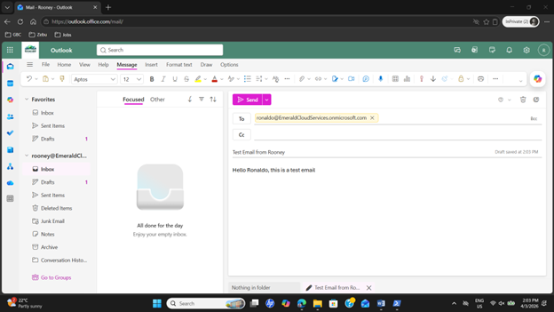
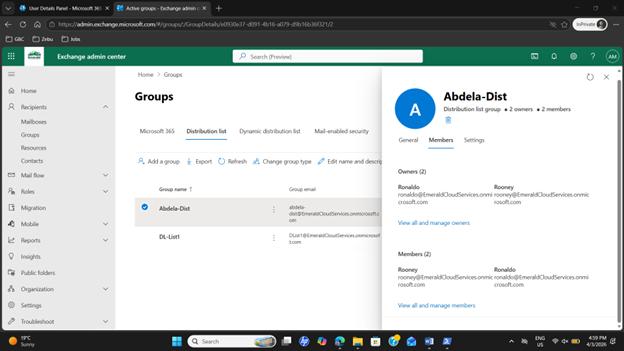
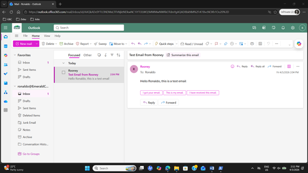
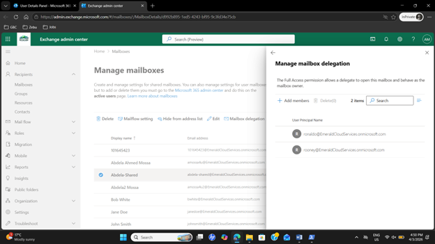
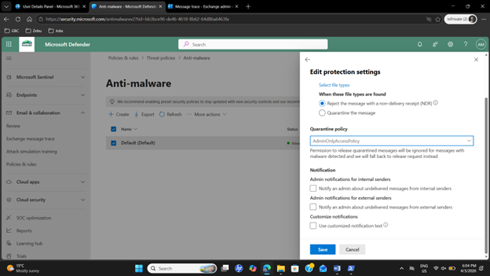

---

## 📁 SharePoint & OneDrive

Configured document management and sharing policies.

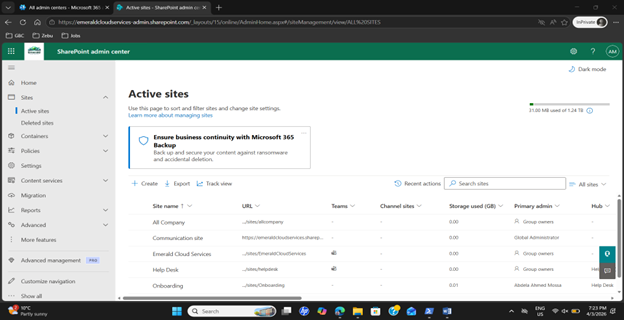
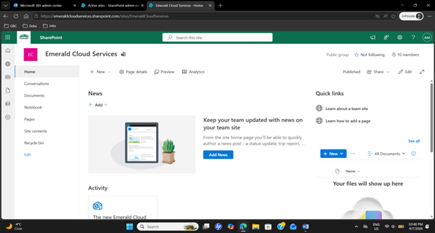
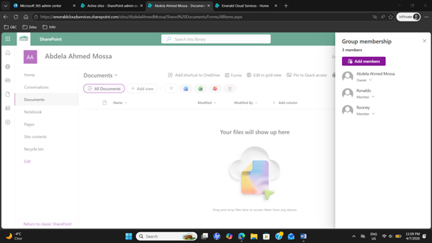
<!--  -->
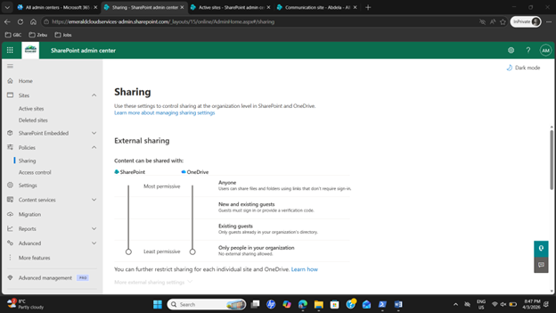

# 🚀 Skills Demonstrated

* Identity & Access Management (IAM)
* Microsoft 365 Administration
* PowerShell Automation
* Exchange & SharePoint Management

---

# 🎓 Academic Context

This project was developed as part of:

* Microsoft 365 Identity and Services – Enterprise Administration

It reflects hands-on lab work simulating real enterprise environments.

---

# 👨‍💻 Author

**Abdela Ahmed Mossa**
